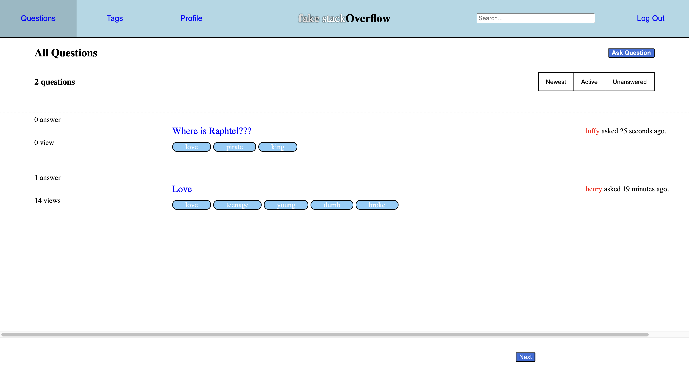
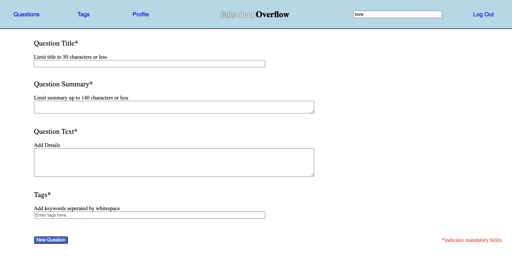
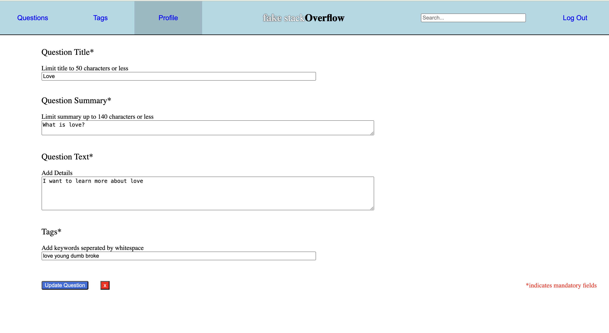
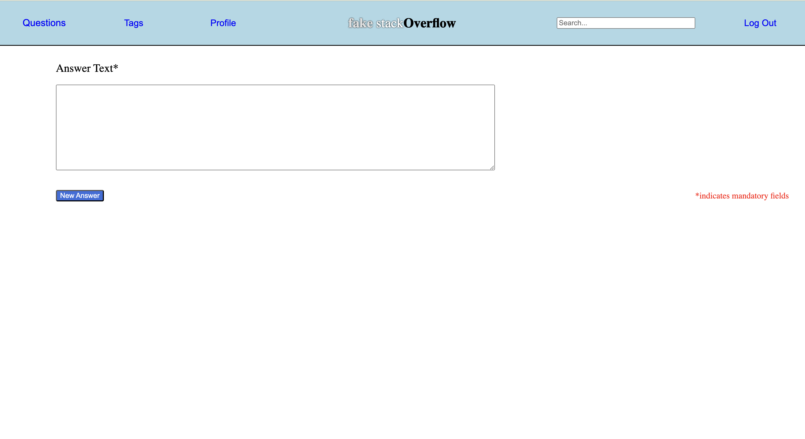
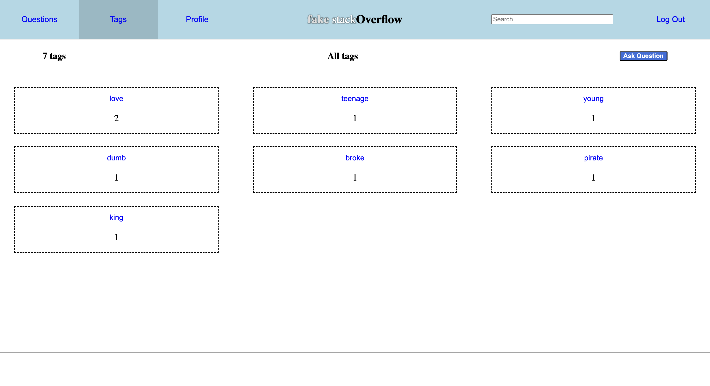
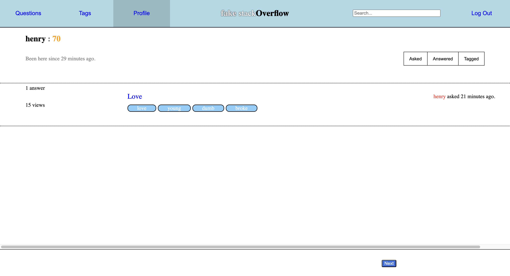
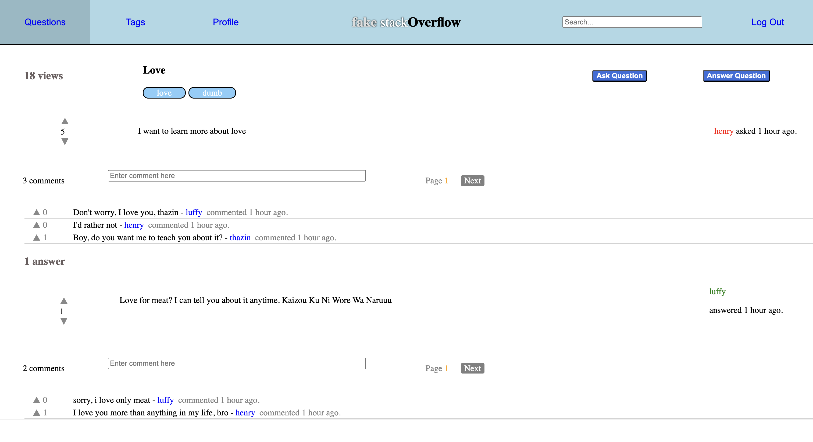

# fakeStackOverflow

## 1. Installing MongoDB (mongod)

MongoDB is a NoSQL database that stores data in a flexible, JSON-like format. To use MongoDB, you need to install it on your system.

### Windows

Download MongoDB Community Edition from the official MongoDB website.

Install MongoDB and ensure that mongod.exe and mongo.exe are added to your system's PATH.

Start MongoDB by running the following command in the terminal:

```
mongod
```

This will start the MongoDB server on the default port 27017.

### macOS

Install MongoDB using Homebrew:

```
brew tap mongodb/brew
brew install mongodb-community
```

Start MongoDB:

```
brew services start mongodb-community
```

### Linux (Ubuntu/Debian-based)

Update package lists and install MongoDB:

```
sudo apt update
sudo apt install -y mongodb
```

Start MongoDB:

```
sudo systemctl start mongod
```

Enable MongoDB to start on boot:

```
sudo systemctl enable mongod
```

## 2. Installing Mongoose (mongoose)

Mongoose is an ODM (Object Data Modeling) library for MongoDB and Node.js.

Steps to Install Mongoose

Ensure you have Node.js and npm installed:

```
node -v  # Check Node.js version
npm -v   # Check npm version
```

If not installed, download and install Node.js from Node.js official website.

Create a new Node.js project (if not already done):

```
mkdir my-mongo-app && cd my-mongo-app
npm init -y
```

Install Mongoose using npm:
```
npm install mongoose
```
## 3. Running fake_so

`fake_so` is a mock implementation of a Stack Overflow-like application that uses MongoDB and Mongoose.

### Steps to Set Up and Run fake_so

Ensure MongoDB (mongod) is running:

```
mongod
```
Keep this running in the background.

Clone the fake_so repository (if applicable):
```
git clone <repository-url>
cd fake_so
mongosh mongodb://127.0.0.1:27017/fake_so
```

Open another terminal, go to server and run the server:

```
cd server
npm install
npm start
```

Open another terminal, go to client and run the application:
```
cd client
npm install
npm start
```


### Running

```
Client : http://localhost:3000
Server : http://localhost:8000
MongoDB: mongodb://127.0.0.1:27017/fake_so
```

## 4. Functionalities

* Users authentication are securely stored
* Users can view questions in the question board in either Newest / Active / Unanswered order.
<figure style="text-align: center;">
    
    <figcaption>Fig 1: Question Page</figcaption>
</figure>

* Users can ask questions in the question form
<figure style="text-align: center;">
    
    <figcaption>Fig 2: Question Form</figcaption>
</figure>

* Users can update their questions 

<figure style="text-align: center;">
    
    <figcaption>Fig 3: Edit Question Page</figcaption>
</figure>

* Users can answer the questions

<figure style="text-align: center;">
    
    <figcaption>Fig 4: Answer Form </figcaption>
</figure>

* Users can navigate the questions associated with the tags in the Tag Page.

<figure style="text-align: center;">
    
    <figcaption>Fig 5: Tag Page</figcaption>
</figure>

* Users can navigate what they asked for, what they answered, and their points in the profile page.

<figure style="text-align: center;">
    
    <figcaption>Fig 6: Profile Page</figcaption>
</figure>

* Users can like, comment, and view the question and answer.

<figure style="text-align: center;">
    
    <figcaption>Fig 7: Answer Page</figcaption>
</figure>

* Users can search for question/answers with word in the search bar

<figure style="text-align: center;">
    
    <figcaption>Fig 8: Word Search</figcaption>
</figure>

* Users can search for question/answers with tag in the search bar with `[]`

<figure style="text-align: center;">
    
    <figcaption>Fig 9: Tag Search</figcaption>
</figure>